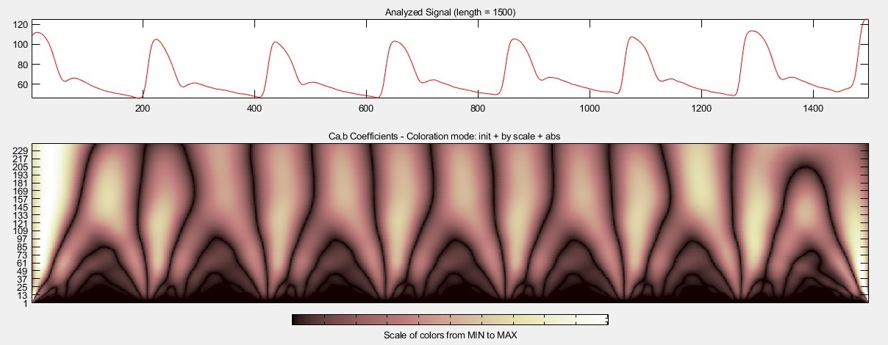
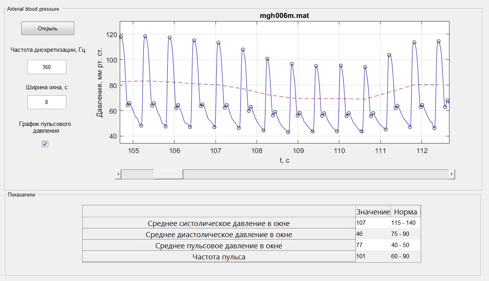

# Система для анализа сигнала артериального давления на основе непрерывного вейвлет-преобразования

Оконное приложение для анализа непрерывного сигнала артериального давления на основе непрерывного вейвлет-преобразования. Производится фильтрация необработанного сигнала артериального давления и выделение точек, соответствующих диастолическому давлению, систолического пику, дикротическому зубцу и дикротическому пику. Также рассчитываются показатели среднего систолического, диастолического и пульсового давления в окне, а также частота пульса.

# Особенности
- Возможность выбора ширины окна просмотра сигнала артериального давления и перемещение по нему
- Выделение всех ключевых точек
- Расчет основных показателей артериального давления

# Результат работы
**_Скейлограмма_**

**_Окно программы_**

